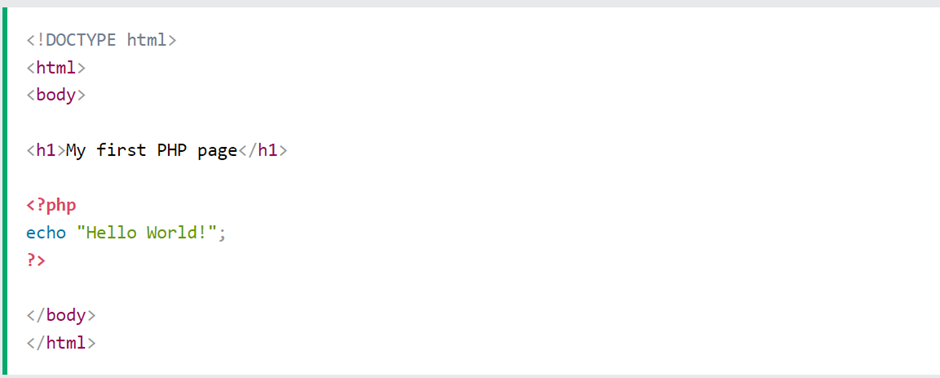

## BE 1.1 PHP
PHP is a free and open-source scripting language also known as a server-side scripting that is most commonly used as backend language communicating with the server. PHP was previously called Personal Home Page but later became a recursive acronym for Hypertext  Preprocessor. PHP is compatible with all operating systems such as Windows, Linux, Unix etc. and most servers like Apache and IIS. 
PHP is used in areas where functionalities that are normally handled in the browser are not able to be solved. Such cases are typically related to data where data is created, displayed, updated, or deleted (CRUD). This type of data is stored in a server which is outside a user’s computer. Data in the browser (front-end) are short-lived and temporary whereas data stored in the server has long-lasting regardless of what occurs in the browser. 
The benefits that come with data being stored in the server is that it allows developers to use PHP as a backend language to communicate and control the logic of the server which user’s do not have access to. In addition, using PHP as a backend language allows developers to manage different types of users such as normal users, admin, and editors. This in turn enables developers to give different levels of access and control of data to the different roles of users. 
PHP is easy to use and there are lots of documentation which describes how to use it, one such site is PHP own website: https://www.php.net/manual/en/
PHP files have the extension  .php and to start working on PHP file, we use an opening and an ending php tag and thus the code within is PHP. 

Here an example:

```
<?php
echo "Hello World!";
?>
```
As shown above, the opening tag of PHP is ```<?php``` and the ending tag is ```?>``` and echo is known is a PHP statement used to output data or string such as in this case it will display ```Hello World!``` .
The most advantageous part with PHP is that developers can write PHP inside HTML and vice versa. 

Here is an example:

<p align = "center">
    
</p>  

As you can see above, PHP is written within HTML.

# **Sources**:  

1. [chasacademy.instructure.com](https://chasacademy.instructure.com/)
    - PowerPoint [Tisdag 21.11] - Backend intro och PHP grunder
    - PowerPoint [Onsdag 22.11] - PHP utvecklingsmiljö (Docker)
    - PowerPoint [Torsdag 23.11] - PHP forms


