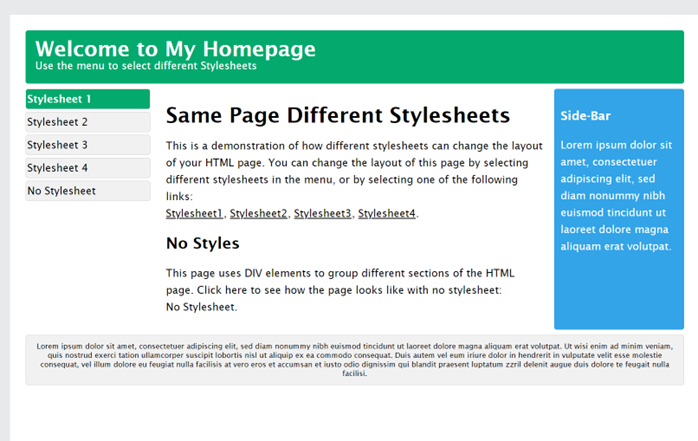

## HC 1.1 HTML & CSS
HTML is an abbreviation for Hypertext Markup Language and is essentially a language meant for a computer to understand. The main purpose of using HTML is to structure content on the web. HTML is one of the core building blocks used for creating a website. The content displayed in majority of websites is HTML. Tim Berners-Lee created HTML from the basis of Standard Generalized Markup Language [SGML] and released it in 1995. The main purpose of HTML is to create a website for personal or commercial use and HTML provides developers with several tools to accomplish this. 
To use HTML, you must have a text editor that is compatible with HTML. Majority of text editors accepts HTML; however, some well-known text editors are the following: Visual Studio Code, Atom and Notepad. The blueprint of all HTML code consists of the following code snippet:
```
<!DOCTYPE html>
<html lang="en">
<head>
    <meta charset="UTF-8">
    <meta name="viewport" content="width=device-width, initial-scale=1.0">
    <title>Document</title>
</head>
```
```<!DOCTYPE html>``` is a declaration that defines the document type and the specific version that will be displayed on the browser. 
Content within angle brackets < > are called tags, there are opening tags and closing tags. For instance, ```<head>``` is an opening tag and ```</head>``` is a closing tag. Tags acts as containers in order to contain content.
Within the ```<head>```  tag, are metadata which stores information about the current document such as title, links, stylesheet etc. This information is not visible on the website.
The ```<body>``` tag covers the bulk of the HTML content and is the content that will be displayed on the website in the web browser. 
Here’s a simple example of a starting pointing for building a website:

```
<!DOCTYPE html>
<html lang="en">
<head>
    <meta charset="UTF-8">
    <meta name="viewport" content="width=device-width, initial-scale=1.0">
    <title>Document</title>
</head>
<body>
        <h1> HELLO WORLD </h1>
</body>
</html>
```

In the above image, the ```<h1>``` tag represents the webpage title or headings. The  ```<h1>``` tag is part of many similar tags up to  ```<h6>```. The greater the number in h, the less important it is in the document structure.
The next part in building a website is applying style to enhance the appearance of the website. To achieve this, CSS is implemented.

CSS is an abbreviation for Cascading Style Sheet and its purpose is to style and control how HTML will look like during the creation of a website. CSS can for example control where HTML elements can be positioned, it controls how websites appear on a printer and on other forms of media. The most advantage’s part of CSS is that a single file of CSS can control multiple HTML files or pages.

Here's an example of how CSS styles a website:

<p align ="center ">

</p>  

The html element ```<h1>``` Welcome to My Homepage ```</h1>``` was styled by using CSS.
One way of styling the ```<h1>``` tag above could be accomplished in the following manner:

```
h1{
    background-color: green;
}
```
In CSS, tags such as h1 that are styled are named selectors and the background-color is known as property and the color is the value.

# **Sources**:  

1. [chasacademy.instructure.com](https://chasacademy.instructure.com/)
    - PowerPoint [Tisdag 19.9] - HTML och CSS
    - PowerPoint [Tisdag 20.9] - CSS positionering
2. [w3schools.com](https://www.w3schools.com/css/css_intro.asp)