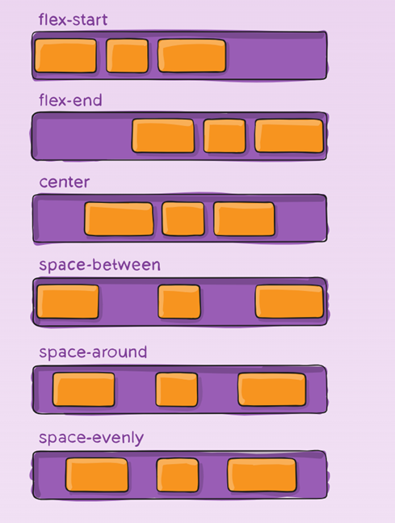
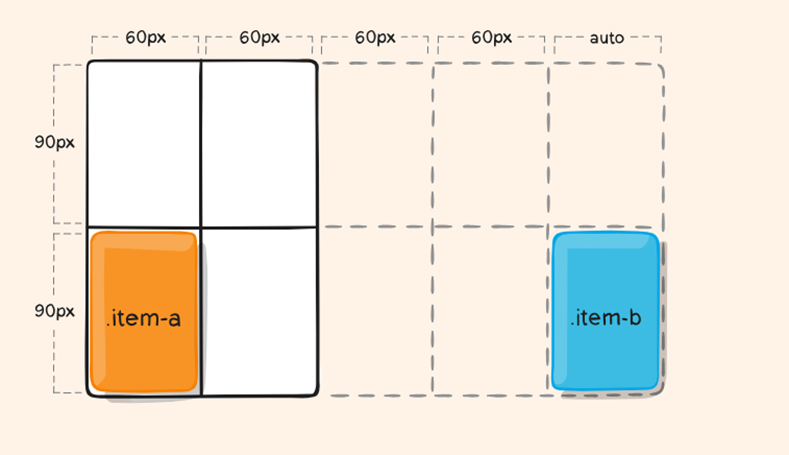

## HC 1.2 Responsiv design
Responsive design refers to a website that can smoothly and efficiently adapt to all devices and screen sizes when visiting the site. There are 5 main reasons for implementing a responsive website. 

The first beneficial reason is that it will reduce costs, especially if the company is big. The reason cost will be lower is because you will only create a single website that is able to adapt to all devices and screen sizes. If a website is not responsive, more money will be spent on creating websites for all devices and screen sizes and there will also be cost for maintaining it.

The second beneficial reason is that a responsive website will reach a bigger audience because people use different devices such as mobile phones, laptops and even stationary pc.

The third reason to have a responsive website is that it will attract a more loyal audience because its user friendliness will be greatly appreciated. This in turn will result in more people remaining for longer periods on the website.

The fourth reason is that a responsive website will rank higher up in Googles SEO search due to Google prioritizing mobile friendly websites
.
Lastly, one of the biggest reasons to implement a  responsive website is that it’s easy to maintain compared to having many different websites for different devices and screen sizes. Changes to a website that is not responsive requires adding changes in all devices and screen sizes whereas in a responsive website, changes need to only be made once.

There are different ways to create a responsive website. The first way is by using the units vw and rem, where vw stands for viewport width and rem stands for root em. These are units that adapt to the screen size. If the screen size decreases, then the targeted selectors with units such as vw and rem decrease and vice versa. It is best practice to use vw units for HTML containers and rem units for fonts.  To view the responsiveness occurring for rem units, a breaking point needs to be set. This can be achieved by using media queries targeting specific screen sizes. Breaking point refers to setting a specific screen width in which the style changes to adapt to different screen sizes.

  

The second method is by using flexbox. Flexbox is an effective way of creating a responsive website by targeting single or groups of elements known as flex-items. Flexbox is known as flex-flow direction due to its multidirectional control of elements. Flex-items can be grouped together, separated into different ways such as space-around, space-between, space-evenly, flex-first, flex-end etc. Flexbox can lay flex-items in a row direction or a column direction. However, it is not able to perform this in both directions at the same time. Hence, flexbox is recommended to be implemented for one-dimensional layouts. 

Another similar method to flexbox is called grid. Grid, just like flexbox requires a parent container where grid is applied on and thus will affect its children within its container known as grid-items.

  

The main difference between flexbox and grid is that flexbox is one-dimensional and can only work on row or column at a time whereas grid is able to work in both directions. Grid is mainly used to make more sophisticated website layouts.

To apply flexbox to a container the following property and value is used: display: flex.

To apply grid to a container the following property and value is used: display: grid.

# **Sources**:  

1. [chasacademy.instructure.com](https://chasacademy.instructure.com/)
    - PowerPoint [Tisdag 19.9] - HTML och CSS
    - PowerPoint [Tisdag 20.9] - CSS positionering
    - PowerPoint [Torsdag 21.9] - CSS grid, flexbox och responsivitet
2. [simplilearn.com](https://www.simplilearn.com/tutorials/css-tutorial/css-grid-vs-flexbox#:~:text=Flexbox%20is%20made%20for%20one,Grids%20can%20work%20on%20both.)