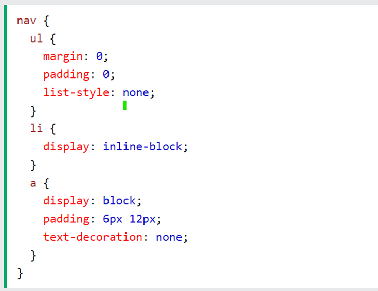

## HC 1.5 CSS Pre-processorer

A CSS Pre-processor is a language used to enhance, maintain, and facilitate the writing of CSS files. CSS Pre-processor provides developers with features and enables creation of functions to eliminate repetitive code, shorten long lines of code, manage bigger projects and to increase productivity through different means. The developer writes in the Pre-processor which is then compiled into pure CSS.

One popular example of a CSS Pre-processor is called Synthetically Awesome Style Sheets [SASS]. This Pre-processor is known as “CSS extension language”. Some of the most used features of SASS are the following: variable, nesting and mixins. 
Variables in SASS are used to store data. To declare a variable in SASS, the dollar sign is used prior to the variable name.  The syntax for declaring a variable is:

<code> $variablename: value; </code>

One of the benefits of SASS is implanting variables to color or font properties. The reason is because it will be easier to alter the color in all areas if they are stored in a variable compared to CSS where changes have been made in every part of the code manually. Another benefit of SASS is the ability to nest the properties. Nesting in SASS allows developers to write code within CSS selectors. This results in code being organized and easier to manage. 

Here’s an example of nesting of a nav selector: 

<p align ="center ">

</p>  

The ```<ul>``` , ```<li>``` and ```<a>``` tags are nested within nav selector. This is one of the benefits SASS allows compared to CSS where given the same example, CSS would present each selector one by one.

The ```@mixins``` is a method used together with ```@include``` to create code that is meant to be used repeatedly. This feature shortens code that is being repeated. 

This is the syntax of ```@mixins```;

```
@mixin name{
    property: value;
    property: value;
}
```

The developer writes ```@mixins``` followed by a desired name and inside the ```{ }``` the repetitive code is typed once. Subsequently, the ```@include``` with the desired name is placed inside the targeted selector in the SASS file.

# **Sources**:  

1. [chasacademy.instructure.com](https://chasacademy.instructure.com/)
    - PowerPoint [Tisdag 19.9] - HTML och CSS
    - PowerPoint [Tisdag 20.9] - CSS positionering
2. [w3schools.com//sass/sass_variables.php](https://www.w3schools.com/sass/sass_variables.php)
3. [w3schools.com/sass/sass_nesting.php](https://www.w3schools.com/sass/sass_nesting.php)
4. [w3schools.com/sass/sass_mixin_include.php](https://www.w3schools.com/sass/sass_mixin_include.php)
