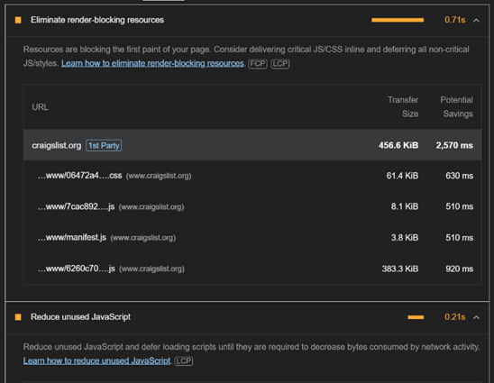
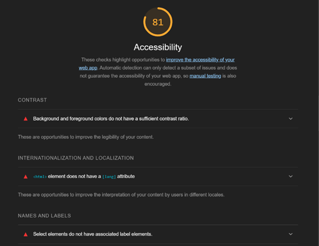

## PG 1.2 Benchmarking
Benchmarking in web development is a process or tool that measures and analyzes different aspects of a website or web applications. The main purpose of benchmarking is to assess the overall quality of a website, its speed and to deduce areas that affect the performance negatively and improve them and to also ensure the performance and quality abides by industry standards. Ultimately, a website or web application with excellent performance according to the benchmark will result in greater user experience, user engagement and greater user satisfaction and thus greater profits.

One way for developers to measure and analyze their website or web application is by using lighthouse. The lighthouse is a tool developed by google and is built-in within google chrome. The tool measures many different aspects of a website such as performance, accessibility, best practice, and SEO. Lighthouse is user-friendly to developers as it provides them with clear and visual representation of the result by presenting it as a score out of  100%. Out of these areas, the performance aspect is the only area Google divides into 3 parts of percentages and shapes with colors. These are the follows parts: 0-49 (red triangle), 50-89 (orange square) and 90-100 (green circle). The red square indicates an error and is urgently required to solve the problem, the orange represents a warning and is just a recommendation to deal with and finally the green color outlines an excellent score. The Lighthouse can be accessed by left clicking and selecting inspect and then on top pressing the symbol >> and finally choosing lighthouse. To start the process of analyzing, press the button with the text “Analyze page load”. The best part with lighthouse is that developers are able to analyze their application in both desktop and mobile versions.

Here is the result of analyzing stockholm.craigslist.org:

    

  

The above result indicates that craigslist has both excellent best practices and SEO. Best practices refer to having clean code, is maintainable and is well protected against cross-site-scripting or other attacks. SEO is Search Engine Optimization and deals with optimizing the website to be visible in the search results which Craigslist is excellent at. 

    
    

  

However, the performance is below the 90-100 interval and indicates it needs some improvements in the warning lighthouse presents. The warning in this case render-resources and unused JavaScript. In regard to accessibility, this refers to how accessible a website is to all users, specifically users with disabilities. In this situation, Craigslist needs to improve some areas such having contrast in colors between background and text color and also to add a language attribute at the top of the HTML document.

# **Sources**:  

1. [chasacademy.instructure.com](https://chasacademy.instructure.com/)
    - PowerPoint [Tisdag 26.9] - CSS ramverk och preprocessor
    - PowerPoint [Onsdag 27.9] - Tillgänglighet
    - PowerPoint [Onsdag 27.9] - Optimering och validering
