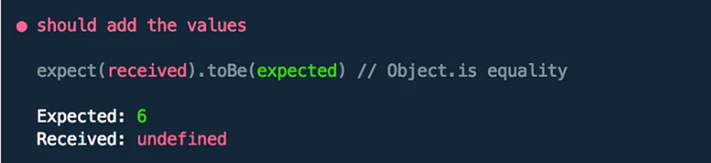

## PG 1.3 Testdriven utveckling
Test-driven development, short for TDD is a methodology for the development of software programs. The goal of TDD is to write tests before writing the actual code. The purpose of following the TDD approach is that it results in better code quality, faster development cycles and ultimately will make the overall result more maintainable and reliable over time. 
Angular is a very popular framework that facilitates the practice of implementing the principle of TDD. The reason for Angular’s close compatibility with TDD is due to it being a component-based framework that uses standalone components, dependency injection and in particular its support for unit testing and functional testing. 

<p align = "center">
    
</p>  

TDD can be divided into three stages, these are the following: writing a test, running the test, and finally writing the code. Consequently, the first step of TDD is writing a test and this essentially involves defining the behavior and functionality that you expect your software to behave.  In Angular, we define the test in the files that have the extension ```.spec.ts```. To run the test, we use the Angular command called ```ng test``` with Karma, a JavaScript framework serving as the test runner. Karma will show our test result in the browser and also in the terminal. When writing our test, we use JavaScript special keywords given by a framework known as Jasmine. Running our test in this stage will naturally fail because we wrote the test before the code.

The following is a simple test:

``` 
it('should add the values', () => {
  const result = addValues(3, 3);
  
  expect(result).toBe(6);
});
let addValues = (value1, value2) {}
```

Now running ```ng test``` will result in the test failing as show below:

<p align = "center">
    
</p>  

However, once the test has failed, we can see the reason for why it failed. And thus, we now can implement the code that fulfill our test:

```
it('should add the values', () => {
  const result = addValues(3, 4);
  expect(result).toBe(6);
});
let addValues = (value1, value2) {
  return value1 + value2;
}
```

And from this code, we can run ```ng test``` and see our test pass:

<p align = "center">
    
</p>  

# **Sources**:  

1. [blog.nashtechglobal.com](https://blog.nashtechglobal.com/unit-testing-and-test-driven-developement/)
2. [blog.logrocket.com](https://blog.logrocket.com/angular-unit-testing-tutorial/)
3. [itnext.io](https://itnext.io/test-driven-development-in-an-angular-world-92c0c42a54d0)
