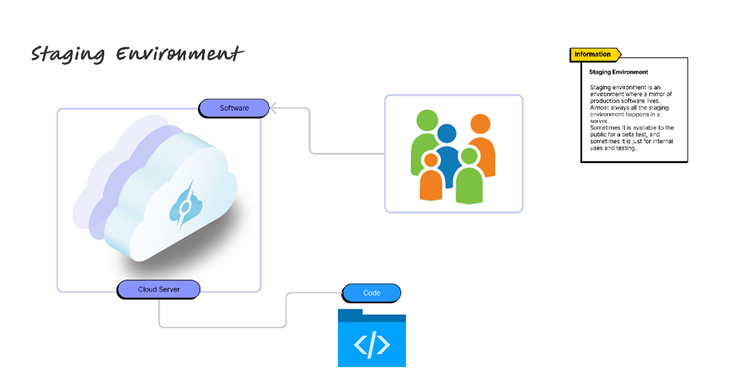
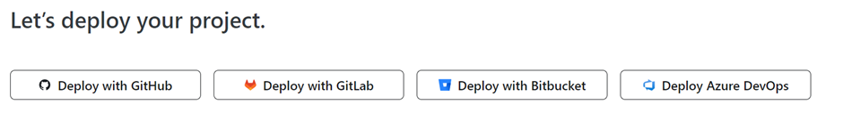
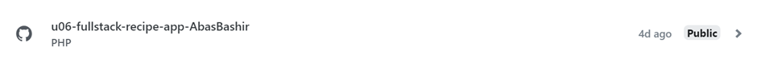
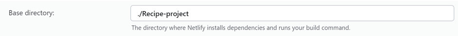
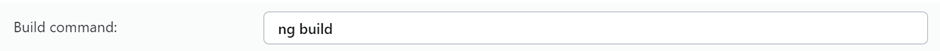
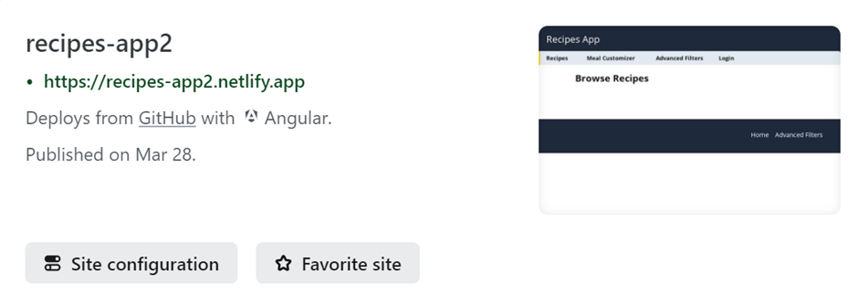

## PG 1.4 Deploy och staging
Deployment and staging environment are one of the most crucial processes that refers to the steps taken in order to release a web application to the users. 

As for deployment, this process is essentially where the web application is ready to be available to users by uploading all the necessary code and dependencies and other resources to a server or a hosting platform. In a more broader term, deployment constitutes synching code files, configuring files, script, and servers for the deployment and in essence ensuring everything is configured correctly in order to run the production environment. Once the web application is deployed, users can visit the web application through a unique URL and from there be able to interact with it. 

<p align = "center">
    
</p>  

On the hand, staging environment is known as pre-production phase and is the last step in the deployment process. Staging environment uses the exact same configurations as the production environment hence is the reason its viewed as a mirror of the production environment with the exception that it is an environment whereby developers test changes and new features before deploying the code to the live website. Staging environment is incredibly important because it reduces risk of any bugs or errors occurring in the live website and will thus prevent any major loss of revenue to companies.

Two popular deployment platforms used for hosting a web application and that plays a vital role in the process of deployment and staging environments are Render and Netlify. Netlify focuses on the deployment of front-end applications such as Angular whereas Render has a wider specialization and can focus on from simple static website to full-stack deployment.

Here are the steps for deploying on Netlify:

Step 1: Create a Netlify account by visiting their official website https://netlify.com/

Step 2: Once you have an account, select GitHub in order to deploy your project

<p align = "center">
    
</p>  

Step 3: Pick the project you want to connect to for deployment.

<p align = "center">
    
</p>  

In subsequent steps, we will go through the configuration steps. To do this, navigate to ```site configuration ---> Build & deploy ---> Continuous deployment```.

Step 4: In the building settings, change the base directory to your Angular application folder name. In this example, the folder name is ```./Recipe-project```.

<p align = "center">
    
</p>  

Step 5: Next, type ```ng build```  on the build command.

<p align = "center">
    
</p>  

Step 6: Finally, on the last step change the publish directory to ```./yourFolderName/dist/yourFolderName/browser```

<p align = "center">
    
</p>  

Once you have configured all the necessary steps, you can now visit your live website by clicking on the URL provided by Netlify:

<p align = "center">
    
</p>  

# **Sources**:  
1. [chasacademy.instructure.com](https://chasacademy.instructure.com/)
    - PDF [Tisdag 26.03] - Netlify-Render-deploy
2. [umbraco.com](https://umbraco.com/knowledge-base/staging-environment/#:~:text=A%20staging%20site's%20main%20purpose,they%20never%20affect%20the%20user)
3. [medium.com](https://medium.com/swlh/how-to-set-up-your-staging-environment-for-web-applications-480e0138e620)
4. [servermania.com](https://www.servermania.com/kb/articles/production-development-staging)

