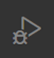
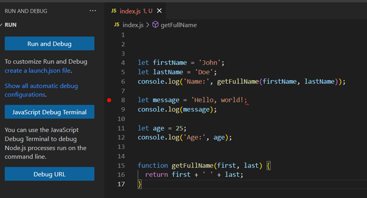

## PG 1.5 Debugging
Debugging in the web development aspect is the process in which developers examine their executable code to identify the stages of their source code and to also locate where or how errors take place during runtime. The purpose of debugging is to analyze the source code, its variables, and functions and to identify the key difference between the desired behavior developers expect and the actual behavior that takes place. In essence, the goal of developers is to investigate the code and refine it in order for it to adhere to the intended expectations. By following this approach, it contributes to good quality, becomes reliable and increases the performance of the website or web application.

In regard to identifying problems, the most typical and hardest part to identify without debugging are syntax errors or logic. Normally in a project the source code is more than 1000 lines of code, and therefore identifying the problem can be very challenging. 

For example:
```

let firstName = 'John';
let lastName = 'Doe';
console.log('Name:', getFullName(firstName, lastName));
let message = 'Hello, world!;
console.log(message);
let age = 25;
console.log('Age:', age);
function getFullName(first, last) {
  return first + ' ' + last;
}
```

In the above example, at first sight it might be difficult to assess what the root problem is. And a bad approach to go about investigating and identifying the exact error is by manually reading line for line attempting understand every line. Now although this example is quite simple to locate the problem, in real projects this approach is ineffective. Therefore, the solution for all executable source code is solved by using the debugger.

<p float ="left" align = "center">
    
    
</p> 

In Visual Studio Code environment there is a built-in debugger that is represented with a bug and a triangle next to it as shown above. To debug and analyze the different stages, VS code has provided developers with break points. Break points are indicators represented with a red dot and this essentially allows developers to be able to pause the execution of code and analyze its values. In addition, developers can use other control features once the debugger is launched such stepping into, stepping over, and continue execution. These control features are used to navigate through the source code. To activate the debugger, a starting breakpoint is selected and then the button with the text ``` Run and Debug``` is pressed. Once the debugger is activated, we discover that the error in the example is due to a missing quotation mark at the end of ```'Hello, world!;'```.

# **Sources**:  

1. [chasacademy.instructure.com](https://chasacademy.instructure.com/)
    - PowerPoint [Tisdag 26.9] - CSS ramverk och preprocessor
    - PowerPoint [Onsdag 27.9] - Tillgänglighet
    - PowerPoint [Onsdag 27.9] - Optimering och validering