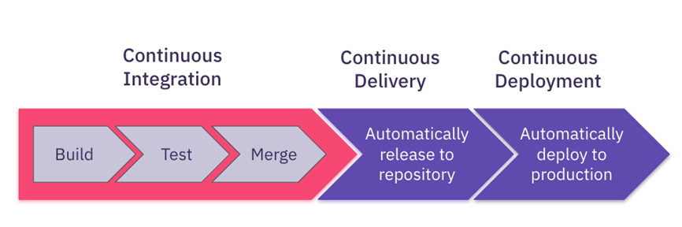
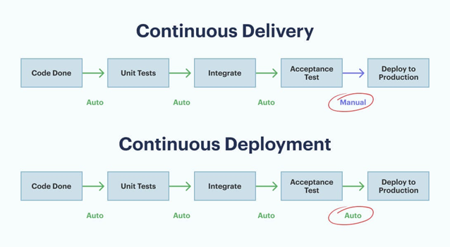

## PG 1.8 Automatisering av arbetsflöde
Automatization of workflow in web development involves following the CI/CD methodology. CI/CD is short for Continuous Integration/Continuous Deployment and is essentially a collection of practices that handles the automatization of code. By following the CI/CD approach, developers are regularly able to integrate their code with the shared repository or branch and the new changes are automatically deployed to the production environment once they have been approved. Thus, this allows developers to sync code more continually and reliably and ultimately reducing the risk of errors and minimizes downtime.

    

  

CI stands for Continuous Integration and this methodology essentially deals with the main automatization process. In CI, developers regularly make changes to their code and then integrates their changes to the shared repository or branch found on GitHub or other platforms which in turn builds and performs automated tests such as unit tests and integration tests. The tests act on everything from classes to functions and other various modules throughout the application. With the aid of CI, the automated tests facilitate the discovery of issues or conflicts that might occur during a merge early in the development stage. This will allow the team of developers to handle the problem quicker and more efficiently.   

    

  

CD, on the other hand can be divided up into 2 distinct concepts called Continuous Delivery and Continuous Deployment. Once our CI is working the next phase is the Continuous Delivery phase. Continuous Delivery is essentially the process where any changes to the shared repository are ready to be deployed to the production environment. In essence, this means that any code that goes through the CI pipeline is ready to be deployed and thus accessible to users. On the contrary, Continuous Deployment is one step above Continuous Delivery whereby the deployment to the production environment is automated without the need of approval by someone. This basically means any changes such as new features or bug fixes are pushed and then automatically deployed to the live web application. 

# **Sources**:  
1. [chasacademy.instructure.com](https://chasacademy.instructure.com/)
    - PowerPoint [Tisdag 13.02] - CI/CD-Deployment
2. [atlassian.com](https://www.atlassian.com/continuous-delivery/principles/continuous-integration-vs-delivery-vs-deployment)
