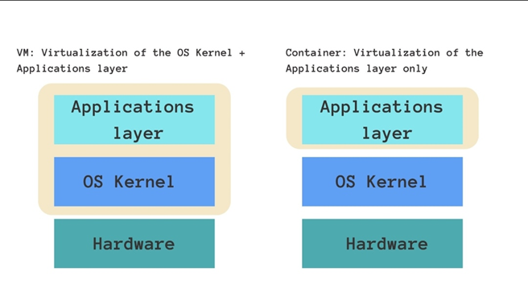

## PG 1.9 Virtualisering av utvecklingsmiljö
Virtualization of development environment in PHP refers to creating an environment where developers work on a local environment on their own machine to test and develop a website or web application. These virtual development environments are virtual containers that imitate the real production environment. To manage these virtual containers a platform called Docker is used.

<p align = "center">
    
</p>  

There are many reasons for using virtual containers on Docker. First off, Docker is a platform for managing containers known as docker containers. The purpose of Docker is used for  developing, shipping, and running applications. While virtual machines are a virtualization that imitate the entire computer which consists of an OS system and the application layer, on the other hand a container is a virtualization of only the application layer. The containers share the OS of the host computer. 

With respect to the benefits of using docker containers, the first benefit is that it establishes an isolated environment from the host machine when developers work on it. This promotes a sense of consistency among different computers once the software or application is shared between team members and thus eliminates the common problem of “it works on your machine but not mine.”. The second benefit of using containers is that developers can package and define the necessary dependencies for the application to work. This in turn eliminates the need for all team members to install the dependencies and specific versions of things such as extensions. Third, the benefit of containers is that they are lightweight and thus easy to ship and thus does not consume a heavy memory space during installation.

Some common docker commands that are used are the following:
1. ```docker --version``` - This  displays the current version of Docker 
2. ```docker ps ``` - This  displays all the currently running Docker containers 
3. ```docker run``` - This  creates and runs a new Docker container

# **Sources**:  

1. [chasacademy.instructure.com](https://chasacademy.instructure.com/)
    - PowerPoint [Tisdag 21.11] - Backend intro och PHP grunder
    - PowerPoint [Onsdag 22.11] - PHP utvecklingsmiljö (Docker)
    - PowerPoint [Onsdag 23.11] - PHP forms
2. [blog.fortrabbit.com](https://blog.fortrabbit.com/tools-for-php-development-local-dev-site-setup)