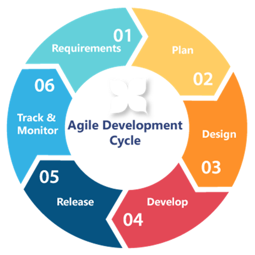
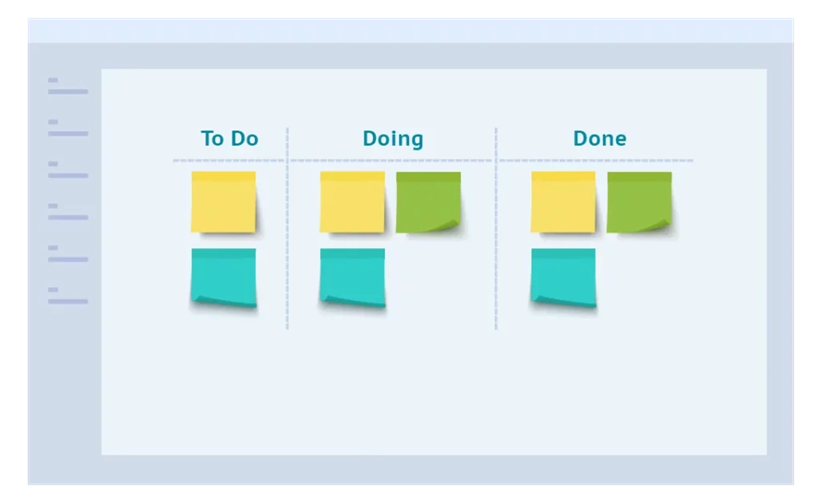

## PJ 1.1 Agila metoder (Scrum, Kanban, Extreme Programming)

Agile approach is a popular methodology that is implemented in various projects. The purpose of using an agile approach is the many benefits that it provides. With an agile approach, adapting to change is easier, where changing requirements late in the project are accepted and working software is valued over extensive documentation. 

Here are the stages of agile approach:

  

There are several sub methodologies in agile approach. The following are the most recognized methodologies: Scrum, Kanban and Extreme Programming.  

Scrum is originally a rugby abbreviation that describes teamwork. However, in agile methodology it has a similar meaning, but the abbreviation stands for Sprint, Commitment, Responsibility and Motivation. Scrum is a special framework that provides guidelines and rules during project planning and development by establishing clear roles, responsibilities and iterations. The purpose of using Scrum is to have a project that can adapt to change, reduce risk and have a faster product launch. The roles defined in Scrum are product owner, scrum master and development team members. The product owner is one or more individuals that oversee the development progress where their main responsibility is to prioritize the correct tasks at the appropriate time and manage product backlog. The scrum master is the team leader for the development team members. Their main responsibility is ensuring smooth and uninterrupted progress, communicating with others involved in the project and hosting daily standup meetings including sprint planning and sprint reviews. The development team are a group of professional members that are self-organized and actively work on delivering an increment of the product at the end of each sprint. 

Sprint is an iteration or cycle of 2-3 weeks where the team work on developing a specific version of the product that will be presented at the end of each iteration. Sprint is one of five activities that is implemented when deciding what should be carried out at the appropriate life cycle of a project.  Sprint planning precedes sprint and is where the team discusses with the product owner regarding what tasks to carry out and the goal known as sprint goal that should be accomplished at the end of each sprint. Part of sprint planning is also having daily scrum or daily stand-up in which each participant informs the rest of what they have accomplished since last meeting and if they have any issues. The sprint review or sprint demo is an informal meeting where product owner, scrum master and the team members take part. The purpose of the meeting is to discuss the progress of the product during the sprint, what has been accomplished and if there are any hindrance that could affect the next sprint. Lastly, the sprint retrospective is meant to evaluate a sprint and commend the team and scrum master for great work.  

Kanban is a sub methodology in agile approach that focuses on visualizing workflow, limit number of current tasks and visualize bottleneck on a board rather than plan, define roles and implement fixed timelines using sprint and sprint reviews. The purpose of using Kanban is to have continuous workflow and focus on quality assurance in early stage and to prevent production stop. 

Here is an example of a kanban board:	

Kanban board tasks are divided into several columns, in this case it’s divided into To Do, Doing and Done. Each column represents a step in the process of delivering the product. The stickers on the boards represent tasks. The tasks on Kanban board starts from left and moves to the right. Kanban approach utilizes Management Work In Progress (WIP) in which the number of tasks being actively worked on is limited in order to reduce stress, equally divide work, prevent bottle neck and thus optimize workflow. This means the To Do column is limited to only including tasks with high priority. By using Kanban board and utilizing WIP including other policies, the Kanban approach can be optimized, data can be collected, and future problems can be predicted. Collecting data can help evaluate Lead Time and take necessary steps to improve workflow.  

Xtreme Programming, short for XP, is another approach of agile methodology. Extreme Programming shares many similarities to Scrum. For instance, both utilizes iterations and deliver specific versions of a products in a timely manner, both frameworks can adapt to changes, teams in both frameworks have shared responsibilities etc. However, they have many differences as well. While Scrum has specific roles such as product owner, scrum master and development team member and utilize sprints and sprint review Xtreme Programming implements pair programming and continues integration.  

 
# **Sources**:  

1. [chasacademy.instructure.com](https://chasacademy.instructure.com/)
    - PowerPoint [Tisdag 3.10] - Att arbeta agilt
    - PowerPoint [Tisdag 4.10] - Agilt User Stories och Scrum
    - PowerPoint [Tisdag 5.10] - Agilt Kanban
