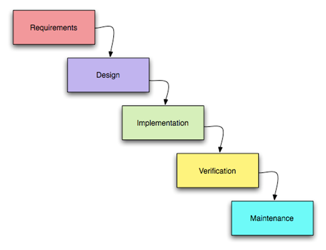

## PJ 1.2 Icke-agila metoder

Non-agile approaches are traditional methodologies that follow a linear trajectory that involves strict planning and documentation during projects. Some examples of projects that follow waterfall approach during house construction, software system for banks and airplane construction. There are several traditional methodologies, the most well known is the waterfall approach. This approach involves dividing the project into fixed phases where each phase must be completed before the next phase is implemented.  The waterfall approach has five stages.

 These are shown below:  

  

The first stage of the waterfall approach is called requirements. Here, the specifications, planning phase and the goal of the project are acknowledged. The project manager then communicates with project sponsors and identifies relevant information such the risks, assumptions, dependencies, quality metrics, costs, timeline etc. Next, the design phase is where the details and documentation regarding the project are crystallized and approved. This stage is also where the project’s schedule, objectives, budgets and essentially the blueprint of the project is designed like using Figma. Next phase is the implementation or coding phase. This is where a software developer most of the time is spent on this phase, where the software for the project is being built based on the design. Next up is the testing phase and this is where the software is being tested based on different quality metrics and customer satisfaction and that it fulfills all the requirements established. If all requirements have been met and the software is working, it is ready to be deployed and launched to the user or customers. The last stage is called maintenance, and this is where minor parts are modified to improve the software, identify errors, and perform general maintenance of the software.  

# **Sources**: 

1. [chasacademy.instructure.com](https://chasacademy.instructure.com/)
    - PowerPoint [Tisdag 3.10] - Att arbeta agilt
    - PowerPoint [Tisdag 4.10] - Agilt User Stories och Scrum
    - PowerPoint [Tisdag 5.10] - Agilt Kanban  

2. [https://www.profit.co/](https://www.profit.co/blog/task-management/the-5-phases-of-waterfall-project-management/#:~:text=Phases%20of%20waterfall%20project%20management%20differ%20from%20one%20project%20to,implementation%2C%20verification%2C%20and%20maintenance.)

