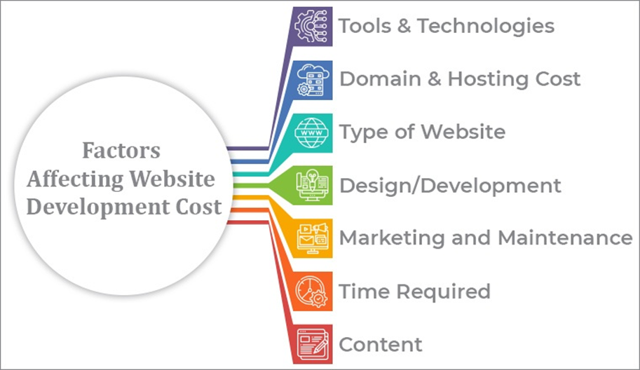

## PJ 1.3 Entreprenörskap inom webbutveckling

Entrepreneurship in web development refers to an individual or small group of partners who turn a particular idea in web development where other providers have not met into a business. This involves running a website or web application that solves a problem that targets a particular audience. There are several reasons for embarking on an entrepreneurial journey. Some of the main reasons are the following: passion, control over what you want to work with, be independent and make profits. However, engaging in entrepreneurship entails determining the type of business structure and expenses in the company likewise the project.  

There are many types of business structures but two of which are well-known are sole proprietorship and limited liability company (LLC). With sole proprietorship, it is not required to have starting capital and you are the sole owner of the business and responsible for the business assets and debts. Thus, if the business is in legal or financial trouble as the sole proprietor, your private assets could be at risk. On the other hand, with limited liability company, a capital investment is required however you are not responsible for the company’s debt given that you are a shareholder. This implies if the company has financial debt your private assets are safe.  

Regarding the business expenses, there are several costs to running a business. Prior to opening, money is spent on research and business plans which is a large and vital part of business. Other expenses are on paying technical materials and loan debt. As for daily expenses, money is spent on paying salaries, marketing, insurance including investing in technical materials. There are many strategies for earning profits and lowering expenses. Some common revenue models are implementing monthly fees or licensing fees to the target audience or other companies.  

Pertaining to project expenses, the expenses will depend on the required tech stack, the complexity of the project and how much UI/UX is necessary. A project has many stages and with it comes further expenses. The first stage is the idea, this is where extensive research is needed and questions such as what skills are required, are there any partners interested in joining and whether the project will make more revenue than expenses are answered. Next stage is design, this where sketches are made by using for example Figma and prototypes for UI/UX are made including getting to know target audience. Following the design stage is the implementation stage where most of the time is spent on creating API:s, graphical interface, and databases. The two last stages are testing and maintenance where the testing phase is when the software is being examined to see if it works and meets all the requirements and the maintenance phase is where general issues are being handled such as bugs and improving features. 

# **Sources**: 

1. [chasacademy.instructure.com](https://chasacademy.instructure.com/)
    - PowerPoint [Tisdag 3.10] - Att arbeta agilt
    - PowerPoint [Tisdag 4.10] - Agilt User Stories och Scrum
    - PowerPoint [Tisdag 5.10] - Agilt Kanban  

2. [https://online.stanford.edu/](https://online.stanford.edu/what-is-entrepreneurship)