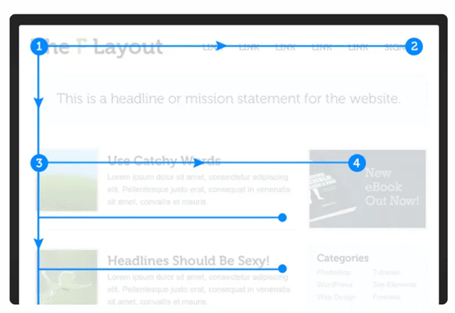
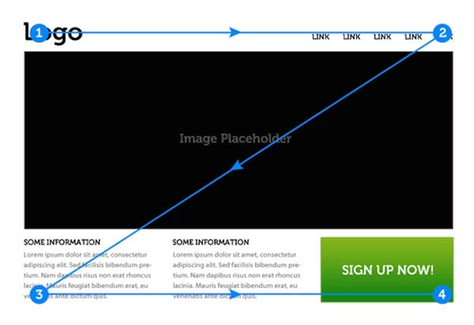

## UD 1.1 Grafik och design för webbsidor

Graphic design is the process of arranging visual content to convey a message and optimize user experience when visiting a particular website. From a company standpoint, some of the purposes of implementing this approach is to have a greater audience base, more recognition and thus greater profit. 

Graphic design can be divided into two parts: UX design and UI design. UX design stands for User Experience and is the experience during the interaction between the user and the product, in this case the website. The goal of UX is to determine how easy it is for a user to navigate and use services such as doing a checkout on a shopping website and subsequently deduce a user needs and requirements for the website. However, part of determining a user’s needs and requirements is spent on research that consists of interviews, tests and analyzing statics which ultimately enables the developer to understand the user mindset. On the contrary, UI is short for User Interface and is the visual elements that allow users to interact with the website. Some examples of UI are buttons, titles, links, sound, and images. The goal of UI is to guide the user through the website with the aid of user interface. UI designers develop the user interface by implementing the discoveries and statics that UX designers collected. 

To accomplish user satisfaction for a website, it is vital to consider the appearance of elements, their position, and their functionality on the website. To begin with, buttons on a website should be positioned well and have clear text describing where its purpose is. Having a text such as “Click Here” is not descriptive enough and can appear suspicious to users. It is also important to reflect an action from clicking a button, for instance the color of the text changes after visiting a website or the background color is different to show the current webpage. Another element is the navigation bar. It is good to implement simple and well-defined navigation bars like dropdown menu or hamburger menu. Here only the main links of the website should be placed, and the menu should be responsive.

  

Other important aspects to consider are language and visual hierarchy. Regarding language, depending on the website, the language used must be based on the personas and user stories gathered by UX designers. If it is a website for the public, then general language should be implemented, and technical terms must be omitted. In addition, limiting sentences and paragraphs are recommended to enhance user experience and satisfaction since it can be tedious to read which leads to users unable to focus and loss of interest. Visual hierarchy also plays a vital role in users focus and interests. There are 2 visual hierarchies’ patterns that can be implemented. These are the F-pattern and Z-pattern. The F-pattern is used when a website has lots of content and the Z-pattern is used when a website has less content. The numbers describe the reading or scanning patterns of how users perceive when they visit a website

# **Sources**:  

1. [chasacademy.instructure.com](https://chasacademy.instructure.com/)
    - PowerPoint [Tisdag 17.10] - UX och UI design samt prototyper
    - PowerPoint [Onsdag 18.10] - Målgruppsanalys och empiriska metoder
    - PowerPoint [Torsdag 18.10] - Användbarhet och grundläggande kognitionspsykologi
2. [w3schools.com](https://www.w3schools.com)