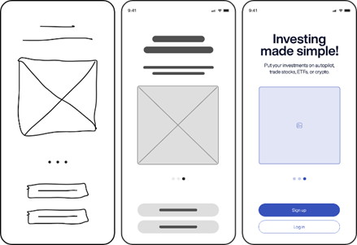

## UD 1.4 Prototyping
Prototyping in web development is the making of an illustration or model for a website that can be hand drawn on a piece of paper or produced using tools such as Figma. Prototyping focuses on the layout, positions of elements including the font and visual hierarchy of the website. The purpose of using prototypes is mainly to present a visual representation of the website to clients before it is developed. Prototypes are also used to save time that is usually spent on changing layout and element positions during the development process.

    

  

There are 2 types of prototypes. These are known as high fidelity and low fidelity. Low fidelity, also known as Lo-Fi is easier to make and requires minimal effort. Lo-Fi is a simple sketch of the website that can be drawn by hand on a piece of paper or use Figma as mentioned earlier. This prototype focuses mainly on the layout and element positions and to receive feedback. The elements are represented as boxes and more specifically images or logos are represented as boxes with a cross as shown in the image (left). Lo-Fi uses greyscale and fonts, colors and element shadows are not used. In addition, it does not require any functionality. It is recommended to draw different versions of    Lo-Fi prototypes in the beginning of the development process mainly to have more layout to choose from. Once low fidelity is approved and well defined, high fidelity can be created. High fidelity or    Hi-Fi prototype is the exact representation of how the website will look and function before being launched. Hi-Fi applies the correct colors, fonts, content etc. and is functional through the aid of Figma tools. The image above to the right is one example of a high prototype.

# **Sources**:  

1. [chasacademy.instructure.com](https://chasacademy.instructure.com/)
    - PowerPoint [Tisdag 17.10] - UX och UI design samt prototyper
    - PowerPoint [Onsdag 18.10] - Målgruppsanalys och empiriska metoder
    - PowerPoint [Torsdag 18.10] - Användbarhet och grundläggande kognitionspsykolog
