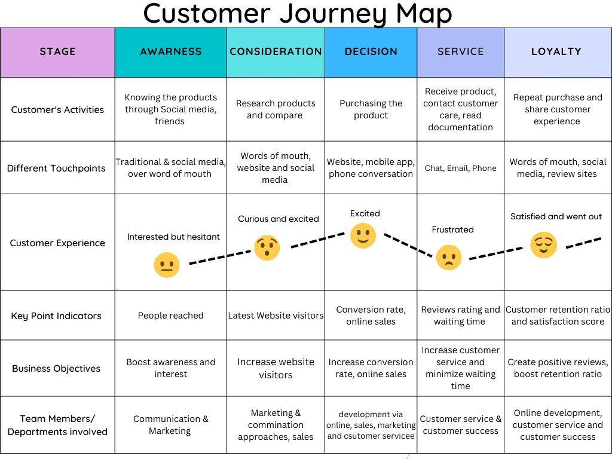

## UD 1.5 Personas och målgruppsanalys
Personas describes the characteristics of the ideal customer or user. It is essentially a fictional description that either represents the whole target audience or a specific part of the target audience. The description of this fictional character includes details about their behavior, interests, and lifestyle. It helps developers and designers visualize and determine the course of the development of the website. On the other hand, a target group analysis refers to a specific group of target audience that an individual or company wants to reach and sell their products or services to. This specific group of target audience share the same demographic area and have similar interests and characteristics. An example of a target group analysis is the following:

* Gender: Male
* Age: Between 28 and 30 years old
* Demographic: Gothenburg
* Income: between 26000 and 34000 Sek
* Characteristics & Interests: Likes watching football and working out

The purpose of implementing analysis of a target group is that it allows designers and developers to create a website with a layout and features specifically tailored to that target audience. This in turn leads to greater user experience and satisfaction. 

    

 

Other ways of establishing greater user experience and satisfaction are by implementing a customer journey map. This is a visual timeline representation of the user’s interaction with a service or product. To create a reliable customer journey map, the user must be established through the use of  a persona. As shown above, developers can see the different stages and better understand the user, their experience, and their feelings from one scenario to the next. And based on this, they have a  better grasp of the areas that are relatively stable and the areas that need improvement.

# **Sources**:  

1. [chasacademy.instructure.com](https://chasacademy.instructure.com/)
    - PowerPoint [Tisdag 17.10] - UX och UI design samt prototyper
    - PowerPoint [Onsdag 18.10] - Målgruppsanalys och empiriska metoder
    - PowerPoint [Torsdag 18.10] - Användbarhet och grundläggande kognitionspsykolog